# GAP Django Boilerplate template


<details><summary><h2><b>Application Overview</b></h2></summary>

### Boilerplate for smaller projects (Scaffolding)
This boilerplates is a  “Starter Kit” . That targets novice developers or new early adopters. 

It focuses on fast prototyping by creating the elements which are necessary for a baseline Django Application. The intent of this application is to provide a baseline for look and feel of future applications that will be put on this platform. The main task/goal of this application is to allow any level of developer the ability to start working on logic without worrying about things like Authentication, Role Based Access Controls RBAC ,Database integration, and building a test harness.  This application was suppose to target a widely used programing language that can easily be picked up. Thus it is implemented using Django framework which is based on Python.

</details><details><summary><h2><b>Design Requirements</b></h2></summary>

* Django Framework
* Database integration
* Role Based Access Controls RBAC
* Keycloak (All-Auth)
* Local Development

</details><details><summary><h2><b>GitLab Set Up</b></h2></summary>

<details><summary>Create GitLab SSH Keys with ssh-keygen</summary>

### Create GitLab SSH Keys with ssh-keygen

Both Ubuntu and Windows machines support SSH out of the box.

Updated versions of Windows 10 and Windows Server have built-in support since 2018, so there is no need to download Putty, PuttyGen or Plink to create RAS keys or to SSH in to GitLab. Just open PowerShell in Windows or a Linux terminal window on Ubuntu  or Mac OSx terminal and issue the following command:

C:\gitlab\ssh\example> `ssh-keygen -o -t rsa -b 4096 -C "ssh-keygen@gitlab.jadeuc.com"`
The options provided to the ssh-keygen command force the tool to create an RSA compatible key using the latest OpenSSL standards. The -C switch simply adds a comment to the end of the public file.

Accept all of the defaults when prompted for a passphrase or a special storage location. By default, all GitLab SSH keys must go in an .ssh folder under the user’s home directory. Furthermore, a blank passphrase is acceptable unless your organization’s compliance rules state otherwise.

This operation will create Git SSH keys named id_ras.pub and id_rsa respectively.

### Copy the public SSH key
You must configure the value of the public key in GitLab. Open the public key in a text editor and copy the value to the clipboard:


Copy the .pub key produced from the GitLab SSH key generation operation and configure it into GitLab.

### Configure GitLab SSH keys
Log into GitLab and click on your account preferences.

Click the SSH Keys link and paste the copied value into the text field.

Set an expiration date, and then click the blue button to persistently add the GitLab SSH key.


Configure GitLab SSH keys under your account preferences.

  </details><details><summary>Generate a Personal Access Token</summary>

### Generate a Personal Access Token
Continue under preferences and select access tokens on the left hand side

 I would name the token based on the IDE you are using. Also notice that you can chose an expiration date for the token. I would also give the token full permissions as shown below. Then I would click generate personal access token.


Next copy and save that token temporarily to a local .txt . You will need it later


</details><details><summary>Create your Gitlab project</summary>

### Create your Gitlab project

Go to [Our GitLab](https://gitlab.jadeuc.com/gap/bza/) and click new sub group.


Recommend naming it with the following convention `<"your project name">`.I would leave the project private until your ready to share it with the rest of the Gitlab teams. Then Click create sub group


Then fork the branch 


Click create blank project. Recommend naming it using  the following convention `<app_"your project name">`


Now you need to fork the app_django_boilerplate into the subgroup you created above

got to [Our GitLab](https://gitlab.jadeuc.com/gap/bza/app_django_boilerplate) and click fork

</details>

</details>

</details><details><summary><h2><b>Install Docker</b></h2></summary>

Please see [link](https://docs.docker.com/desktop/install/mac-install/) for detailed installation instructions.

</details><details><summary><h2><b>Install Rancher & nerdctl </b></h2></summary>

Please see [link](https://rancherdesktop.io/) for detailed installation instructions.

</details><details><summary><h2><b>Set up your IDE & Project: (Using Visual Studios code)</b></h2></summary>

<details><summary>Install and Configure Visual Studio Code</summary>

### Install and Configure Visual Studio Code
 
Install [link](https://code.visualstudio.com/) (download and install the proper version for your OS)

Recommend Installing all of the following extension 

(Required: Python, Pylace, YAML and Database Client) 

(Highly recommend: code auto complete and Django Libraries)

(The remaining plug-ins in the image below are good to have but not required or highly recomended)


</details>

<details><summary>Clone Your GitLab for Local DevInstall and Configure Visual Studio Code</summary>

### Clone Your GitLab for Local Dev
 
Clone your `keycloak_<your_app_name>`  from the fork you created earlier
copy the git link for your `keycloak_<your_app_name>`


Then open VS Code and click "clone git repository"


Then paste the git link into the clone from url bar and click enter


Next create and select a parent folder for all of your applications. I created a folder called  "Visual_Studio_Code_Projects" in my home directory. Make sure you select this folder as the location you want to clone your keycloak application to.


click enter  and select open
</details>

</details>

</details>

</details><details><summary><h2><b>Deploy Application On Local System</b></h2></summary>

<details><summary><b>Deploy Application in Docker</b></summary>

###  Deploy Application in Docker
use the following command to deploy your application to docker: 
`docker-compose up -d` (the -d flag is will make docker run in the background so you can continue to ue the current terminal)

Then you can navigate to http://host.docker.internal:8000/ to view your application.
Next login with select login with keycloak
Default creds for testing are:

(user3 has no Basic_Roles to show that role based acess controls are working for view only access)
user: user1
pass: user1 

(user3 has Data_Edit permision to show that role based acess controls are allowing this user and no other user the ability to edit data)
user: user2
pass: user2 

(user3 has No_Roles to show that role based acess controls are blocking content for users with no roles)
user: user3
pass: user3 

See modify keycloak section to add/remove users and roles. 
See modify application to add role based acess controls to specific page/view/data

</details><details><summary><b>Deploy Container using nerdctl</b></summary>

###  Deploy Container using nerdctl

use the following command to deploy your application to nerdctl: 
`nerdctl compose up -d` (the -d flag is will make nerdctl run in the background so you can continue to ue the current terminal)

Then you can navigate to http://host.docker.internal:8000/ to view your application.
Next login with select login with keycloak
Default creds for testing are:

(user3 has no Basic_Roles to show that role based acess controls are working for view only access)
user: user1
pass: user1 

(user3 has Data_Edit permision to show that role based acess controls are allowing this user and no other user the ability to edit data)
user: user2
pass: user2 

(user3 has No_Roles to show that role based acess controls are blocking content for users with no roles)
user: user3
pass: user3 

See modify keycloak section to add/remove users and roles. 
See modify application to add role based acess controls to specific page/view/data


</details>

<details><summary><b>Deploy Docker Container To Kubernetes</b></summary>

###  Deploy Docker Container To Kubernetes


</details>

</details><details><summary><h2><b>Modify and Tweak Application</b></h2></summary>

<details><summary>CRUD Add Fields</summary>

Go to django>App_CRUD>forms.py and add addittional field to the fields variable.

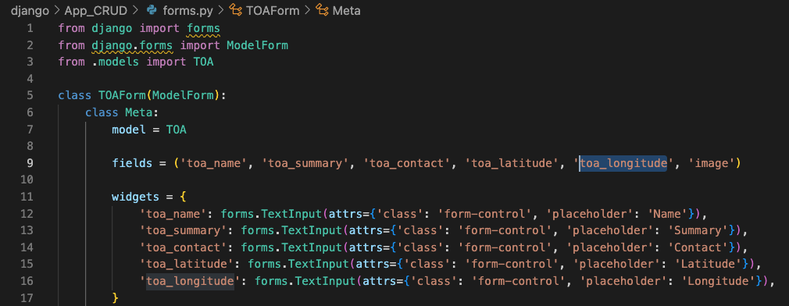

Then copy and past one of the widget lines and modify the name and placeholder as needed.

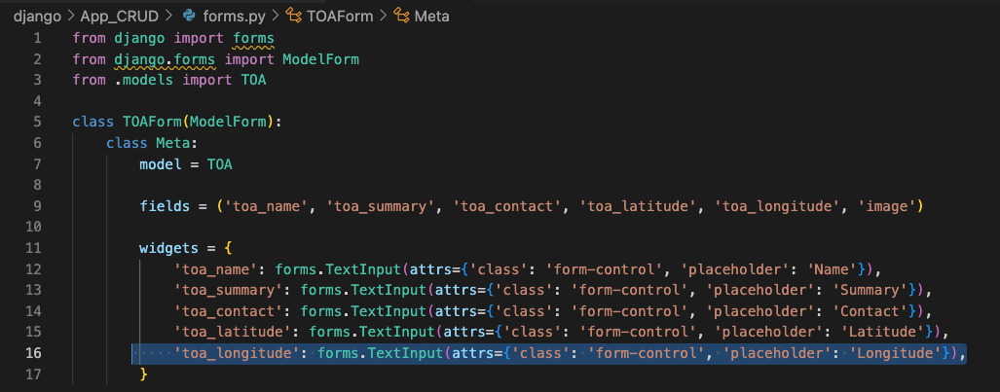

Then go to django>App_CRUD>models.py and add addittional model to the class TOA.

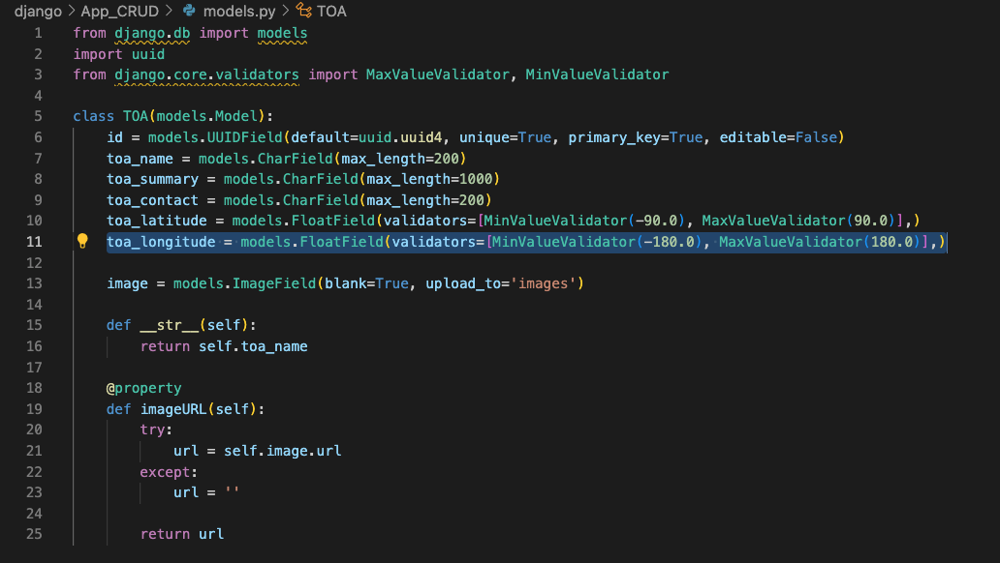

Complete the addition by running  `python manage.py makemigrations` in terminal (this will migrate the fields to the sqlite database)

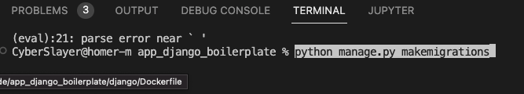

</details>


<details><summary>CRUD Remove Field</summary>

Go to django>App_CRUD>forms.py and remove field from the fields variable.


Then remove one of the widget lines.


Then go to django>App_CRUD>models.py and remove the field model from the class TOA.


Then go to Database plugin and add the sqlite3 file as the database you are editing

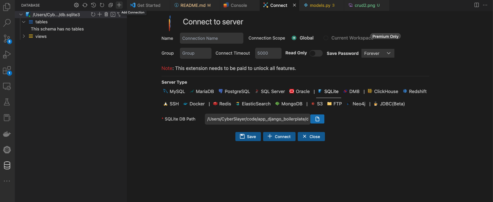

Then remove the table  or rename it so you can pull migrate old data over to the new table 

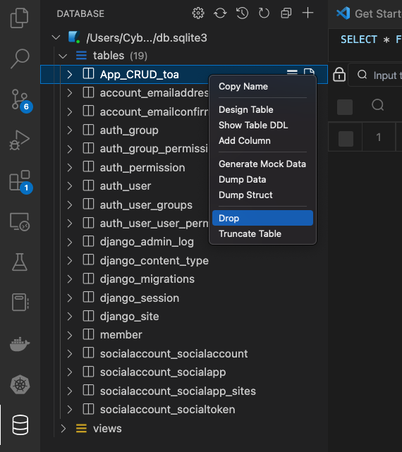

Complete the addition by running  `python manage.py makemigrations` in terminal (this will migrate the fields to the sqlite database)


</details>

<details><summary>Add/Change Role based Access Controls To Pages & Snippets</summary>
go to django>App_CRUD>views_CRUD.py Or your app views

Make sure the import statment of `from Project_Django_Boilerplate_GAP.views import get_user_roles` is found at the top ofyour views.py.

Then add the following to your view definitition: (A view definition defines each new view or webpage the user has access to. You should have a new one for ever html page you present to the user)
```
    roles = get_user_roles(request)
    
    if "Basic_User" in roles:
       access = "TRUE"
    else:
        access = "FALSE"
    context = {
        'login_roles': roles,
        'access': access,
```
Change "Basic_User" to the role that you created for this page in keycloak. (Be sure to use the exact spelling and capitalization input into keycloak)

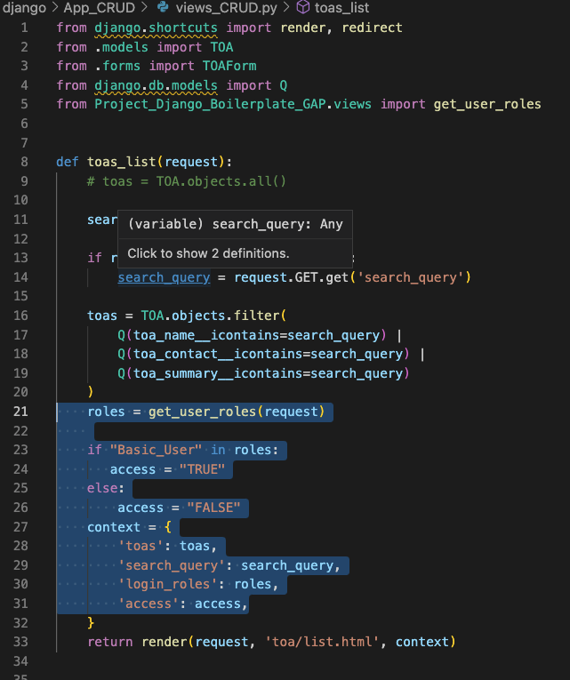


then add the following to your  on your new html template: (This will import context from the statment you created above in your view.py)
```
        
            Your HTML
        
            
```
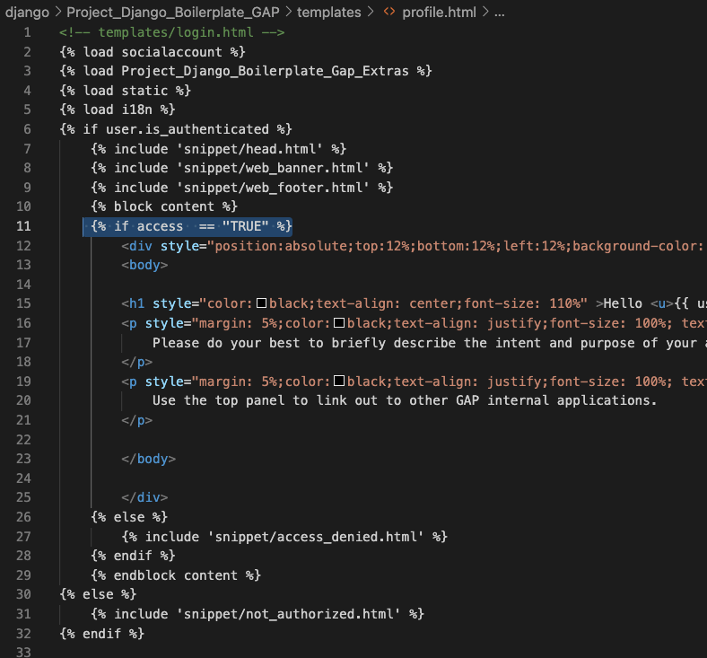

 Snipits are blocks of repeatable HTML that you intend to use in multiple pages ie Headers, Footers, Navigation (This is the main way to keep the look and feel the same outside of .CSS)
 Add your custom snippets under Project_Django_Boilerplate_GAP>templates>snippet"
 Snippits can be added to a page by adding `` to the loaction you want your snipit to load.

 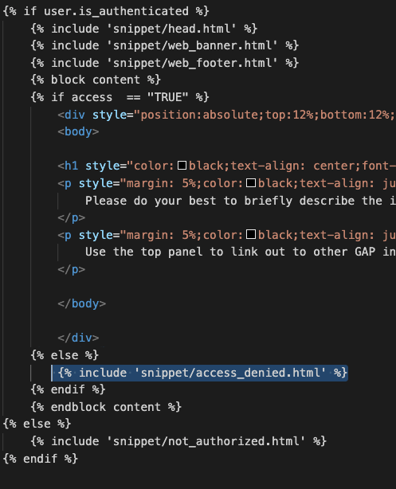

 In order to add static files IE js, css, images make sure to include a static folder with the following hieracy to your app.  Then add `` to the top of the html template your trying to load the static file into. Then use something similar to src="" to load the specific static item into the page.

 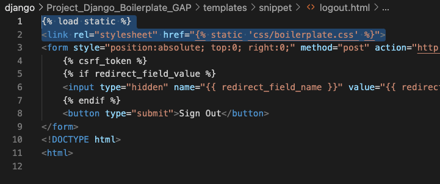
</details>

<details><summary>Modify Global Variables</summary>
Global variables you might want to import include as keys, secrets, and  static variables that get reused often IE web domain.
Go to the django>Dockerfile  and add:
(ENV)    (variable_name) (variable value)
IE:
`ENV KEYCLOAK_ADMIN_PASSWORD admin`

 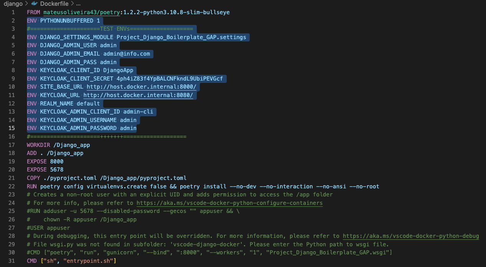

</details>


</details><details><summary><h2><b>Modify and Tweak Keycloak</b></h2></summary>

<details><summary>Pre-Requistes</summary>

###  Pre-Requistes
Pre-req Log into Keycloak using http://127.0.0.1:8080/auth/ 


Click Administration Console "add default user: admin  and pass: admin" Click sign in


Make sure you are in the Default Realm

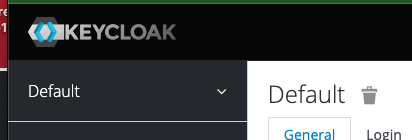

</details>

<details><summary>Add Users</summary>

###  Add Users
Click users on the left hand panel:


Click Add user in right hand corner:


Fill in the Form with user:

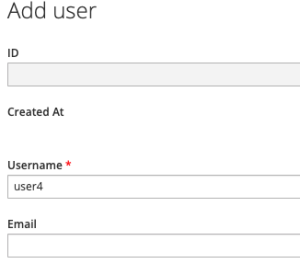

Add a password by going to the credential tab:


Remove user by selecting Delete:


</details>

<details><summary>Add Roles</summary>

###  Add Roles
click on the config>Roles option in your side bar then Click add role:


then fill in form and click save:


</details>

<details><summary>Add Roles To User</summary>

###  Add Roles To User
click edit users under the manage>Users Sidebar selection then click view users:


Select edit user and then select edit ad click on role mapping tab:


then select the role in available roles and "add selected"

</details>

<details><summary>Save Running Keycloak Config</summary>

###  Save Running Keycloak Config

"do not use the import export feature in the keycloak gui" (It doesn't work for your purposes)

"use the below commands modify the <tags> with your specific info"

Use "docker ps" command to display containers and there ids
then use the below commands:

`docker exec -it `<"keycloak container id">` sh`
```
/opt/jboss/keycloak/bin/standalone.sh \
    -Dkeycloak.migration.action=export \
    -Dkeycloak.migration.provider=singleFile \
    -Dkeycloak.migration.file=/tmp/keycloak-gbp-export.json \
    -Dkeycloak.migration.realmName=default \
    -Djboss.socket.binding.port-offset=100
```
Exit `Control C`

`docker cp first_3_of_contaner_id:/tmp/keycloak-gbp-export.json ~/Desktop` Replace first_3_of_contaner_id with the first 3 characters of your target container id

then copy the keycloak-gbp-export.json located on your desktop and replace the default_realm.json in project (ie ./keyclaok/default_realm.json) "make sure you rename the file to default_realm.json) (ie ./keyclaok/default_realm.json"

</details>

</details><details><summary><h2><b>Application Deployent Pipeline</b></h2></summary>

<details><summary><b>CI</b></summary>


</details>

<details><summary><b>CD</b></summary>


</details>

</details>